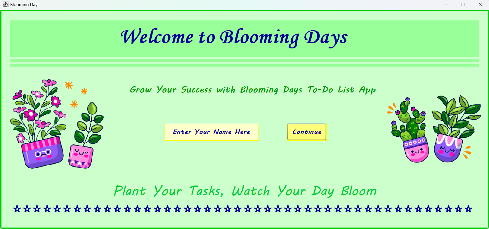
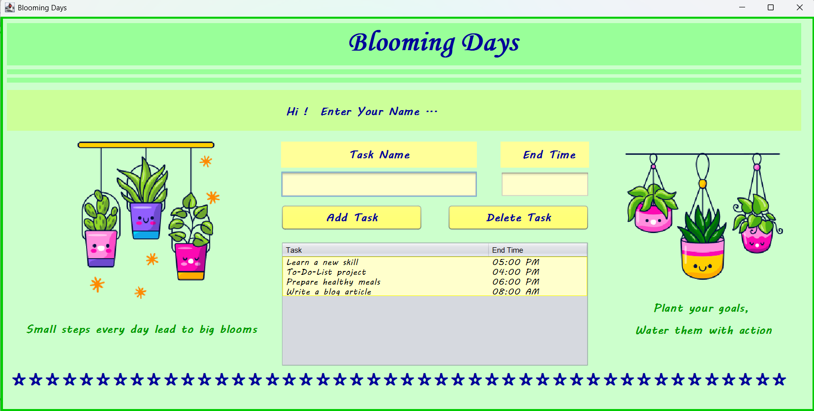

# 🌸 Blooming Days To-Do-List 🍃

<p align="justify"> Implemented the Blooming Days To-Do-List by using the Java programming language. 
That creative graphical To-Do-List application was built using Java Swing. Users can add tasks with an end time, view them in a table, and delete completed tasks. </p>

---

## 🛠 Features

- Add a task with a task name and end time.
- Display all tasks in a table for easy viewing.
- Delete tasks after completion.
- Store tasks in a text file (<code>task.txt</code>) for persistence.
- User-friendly and visually appealing UI with motivational graphics.
- Personalized greeting by entering your name.

---

## 📷 Screenshots

<p align="center">
  <br>
  <b>Figure 1:</b> Login Screen
</p>

<br>

<p align="center">
  <br>
  <b>Figure 2:</b> Home Screen - Task Dashboard
</p>

---

## 🔩 How It Works

### Login Screen
- Enter your name and click **Continue**.
- Your name will appear on the home page as a greeting.

### Home Screen
- Add Task: Enter a task name and end time, then click **Add Task**.
- Delete Task: Select a task from the table and click **Delete Task**.
- Tasks are saved to <code>task.txt</code> automatically.

---

## 🎮 How to Run

1. Clone the repository:

```
git clone https://github.com/Kaveeshamalindi/Blooming-Days-To-Do-List.git
```

2. Open the project in **NetBeans** (or any Java IDE that supports Swing).
3. Compile & run the program.
4. Enter your name and start adding tasks.

---

## 🎨 UI Inspiration

The app is designed with a green and yellow theme which give a refreshing and motivational feel, symbolizing growth and productivity.

---

## 📋 License

This project is free to use and modify for learning purposes.

---

 Don't forget to hit the ⭐ if you like this repo. 

